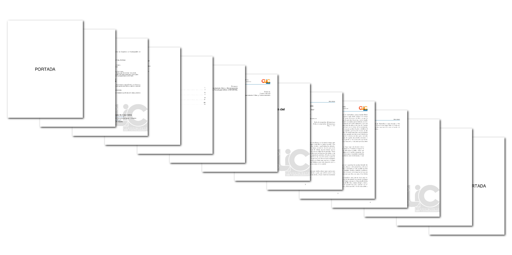
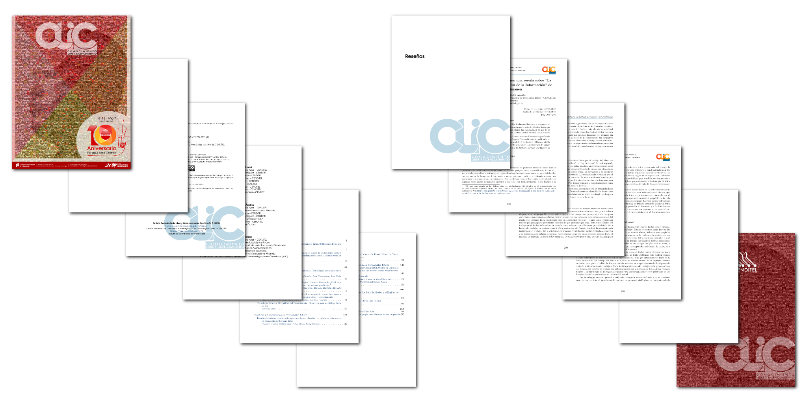

# Plantilla-CLIC
----
Plantilla LaTeX para la Revista Conocimiento y Licenciamiento Libre

Esta versión permite el uso de archivos de bibliografía `.bib`

----
## Estructura de la plantilla base (clic.tex)

```latex
\documentclass[12pt,letterpaper]{book}
\usepackage{cliccenditel}

\nrorevista{X}
\anorevista{Y}
\anocalendario{AAAA}
\autorpresentacion{Nombre Apellido}
\autoreditorial{Nombre Apellido}

\begin{document}

\hojaportada
\hojalicencia
\tablacontenido

\frontmatter
\hojapresentacion
\hojaeditorial

\mainmatter
\fancychapterstyle
\addtocontents{toc}{\cftpagenumbersoff{chapter}}

\chapter{Artículos sobre creación del conocimiento}\BgThispage
\input{art1}

\chapter{Experiencias de Conocimiento Libre}\BgThispage
\input{art1}

\chapter{Reseñas}\BgThispage
\input{art1}

\chapter{Boletines}\BgThispage
\input{art1}

\hojacontraportada

\end{document}
```

----
## Nota
Para que se tomen las bibliografías de forma separada al final de cada artículo se debe compilar un archivo de bibliografía por cada artículo. Ejemplo: `bibtex art1.tex`

----
## Ejemplos

#### Vista previa.


#### Revista Conocimiento y Licenciamiento Libre N°13.



